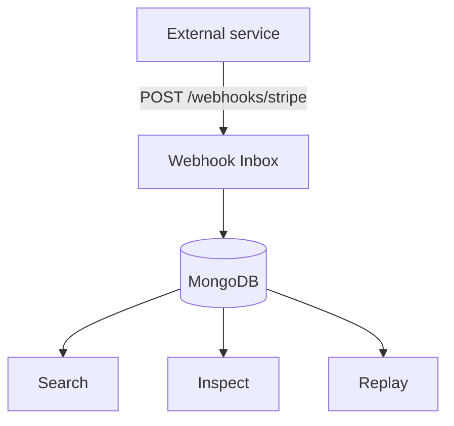
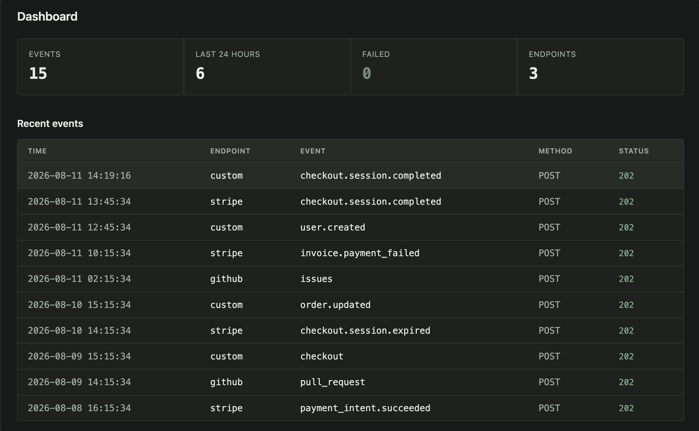
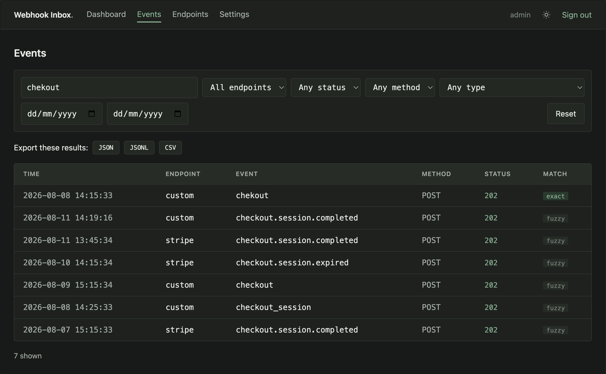
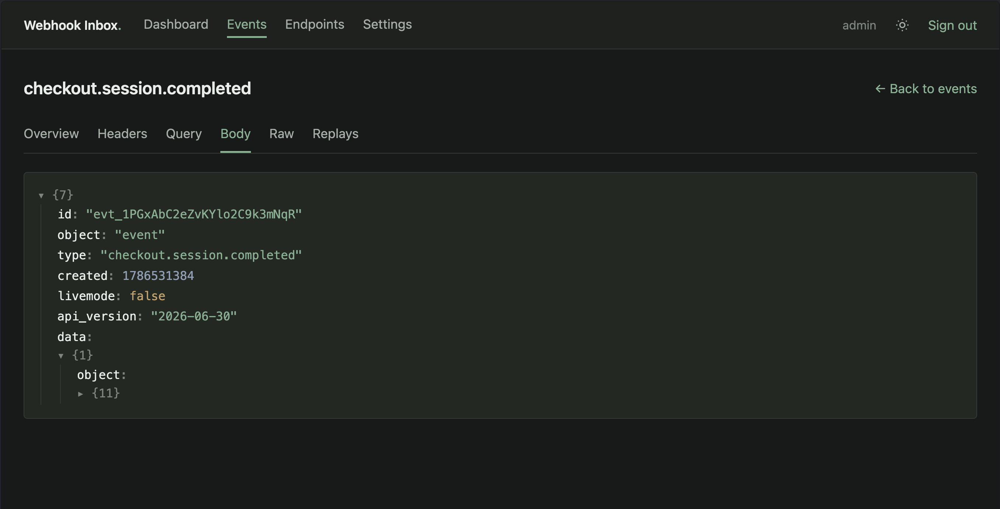
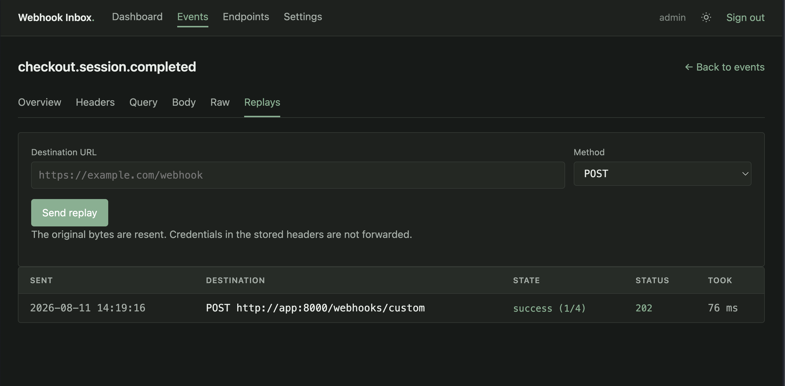
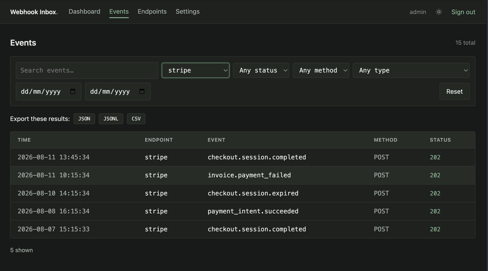

<div align="center">


*A self-hosted webhook inspection, search and replay platform, built with Python and MongoDB.*


</div>

A webhook fails in production. The sender shows a 500 and no body. Your logs have the request id but
not the payload. You cannot reproduce it locally because the event is gone.

Webhook Inbox keeps every request in full — headers, query, body, raw bytes — makes them searchable
even when you misremember the name, and replays them at your local machine so you can debug against
the payload that actually broke.



<div align="center">

</div>

---

## Contents

- [Quick start](#quick-start)
- [The five-minute demo](#the-five-minute-demo)
- [What it does](#what-it-does)
- [Configuration](#configuration)
- [Production](#production)
- [Development](#development)
- [Documentation](#documentation)

---

## Quick start

```bash
cp .env.example .env
docker compose up --build
```

The dashboard is at <http://localhost:8000>. Sign in as `admin`; if you left `ADMIN_PASSWORD` empty,
a password is generated and printed once in the container log.

Send a webhook:

```bash
curl -X POST http://localhost:8000/webhooks/demo \
  -H "Content-Type: application/json" \
  -H "X-Webhook-Event: user.created" \
  -d '{"event": "user.created", "user": {"id": 1827, "name": "John Doe"}}'
```

It appears at <http://localhost:8000/events> immediately.

---

## The five-minute demo

Load realistic data — fourteen events spread over several days across three new endpoints, alongside
the `demo` endpoint that ships by default. Every event is sent through the real signed ingest path
rather than inserted behind it:

```bash
make seed          # add the demo data
make seed-reset    # clear stored events first, keeping your endpoints
```

**1. Search for something you half-remember.** Go to `/events` and type `chekout`. The typo matches
nothing exactly, so exact and fuzzy results are ranked and labelled:

<div align="center">

</div>

The literal `chekout` event wins, and five near-matches follow — `checkout.session.completed`,
`checkout.session.expired`, `checkout`, `checkout_session`. No text index is involved; see
[how search works](docs/architecture.md#search).

**2. Open one and read the payload.** Nested objects and arrays are collapsible, rendered
server-side and fully escaped:

<div align="center">

</div>

Headers, query parameters and the original raw bytes each get their own tab.

**3. Replay it at your local server.** Paste a destination and send. The original bytes are resent,
so a receiver verifying a signature still sees a valid one:

<div align="center">

</div>

Every attempt is recorded with its status and timing. Replay destinations are validated hard —
private addresses, loopback, link-local, cloud metadata endpoints and non-HTTP schemes are all
refused, and the guard re-runs on every redirect hop. See
[replay and SSRF](docs/security.md#replay-and-ssrf).

**4. Narrow it down and take it with you.** Filter by endpoint, status, method, event type or date
range, then export exactly what you are looking at:

<div align="center">

</div>

JSON, JSONL or CSV, streamed rather than buffered, so the size of the result set does not matter.
The export honours the current filters and search query, because both read the same parser.

---

## What it does

**Ingestion.** Any HTTP method, any content type. Bodies that are not valid UTF-8 are stored
base64-encoded. Per-endpoint HMAC-SHA256 or static-secret verification, checked against the untouched
bytes before parsing. Oversized payloads are refused before they are buffered.

**Storage.** One MongoDB document per event holding the complete request. Payloads have no shared
schema and change without warning, which is the case document storage exists for. Both the parsed
body and the raw bytes are kept — they serve different jobs.

**Search.** Exact, prefix, multi-term and fuzzy, ranked in a single query. Terms are derived at
ingest, so search never parses a payload. Fuzzy matching uses trigram overlap; there is deliberately
no `$text` index, and [the reasoning is documented](docs/architecture.md#why-there-is-no-text-index).
Verified on 100,000 events with no collection scan.

**Filtering.** Endpoint, status, method, event type and date range, with keyset pagination that costs
the same on page one and page one hundred.

**Replay.** Resend any stored event to any destination, with retries on timeouts and 5xx but never on
4xx. Delivery runs in-process for development and as its own container in production.

**Retention.** Per-endpoint or global, enforced by a MongoDB TTL index. Deletion is approximate by
design and [documented as such](docs/architecture.md#retention).

**Security.** Argon2id passwords, hashed session tokens, CSRF on every mutation, rate limiting split
between ingestion and sign-in, and a redaction processor that keeps secrets out of both logs and the
search index. See [docs/security.md](docs/security.md).

---

## Configuration

Precedence is `environment > .env > config.yaml > defaults`. Secrets go in `.env`; everything else
can go in `config.yaml`. Nested keys use a double underscore in the environment, so
`rate_limit.requests_per_minute` becomes `RATE_LIMIT__REQUESTS_PER_MINUTE`.

```yaml
replay:
  allow_private_networks: false   # opens every private range at once when true
  allow_redirects: false          # every hop is re-validated when enabled

retention:
  enabled: true
  default_days: 30

rate_limit:
  requests_per_minute: 120        # per endpoint and source
  login_per_minute: 10            # per source
```

Full reference: [docs/configuration.md](docs/configuration.md).

---

## Production

```bash
docker compose -f compose.yaml -f compose.prod.yaml up -d
```

The overlay moves replay delivery into its own container and requires MongoDB authentication, with
the application connecting as a user holding `readWrite` on its own database and nothing else. It
must start from an empty volume, since MongoDB only applies initial credentials when the data
directory is created.

Work through the [production checklist](docs/security.md#production-checklist) before exposing this
to the internet — in particular, delete the seeded `demo` endpoint, which accepts unauthenticated
writes by design so that `docker compose up` is usable out of the box.

---

## Development

```bash
make install      # uv sync
make check        # ruff, mypy --strict, pytest
make test-all     # includes the 100k-event search benchmark
make seed         # realistic demo data
```

Tests need Docker: integration and security tests run against disposable MongoDB containers, and
replay tests against a local stub HTTP server. Nothing touches an external service.

```
355 tests — 135 unit, 91 integration, 129 security
```

Requires Python 3.14 and [uv](https://docs.astral.sh/uv/).

---

## Documentation

| Document | Contents |
|---|---|
| [Architecture](docs/architecture.md) | Data model, index-by-index rationale, how search and replay work, and the alternatives that were rejected |
| [Configuration](docs/configuration.md) | Every setting, its default and its effect |
| [Security](docs/security.md) | Threat model, SSRF defences, secret handling, known limitations, production checklist |
| [Contributing](CONTRIBUTING.md) | |
| [Reporting a vulnerability](SECURITY.md) | |

`examples/` holds ready-to-send payloads for GitHub, Stripe and custom senders, including deliberate
near-matches for demonstrating fuzzy search:

```bash
curl -X POST http://localhost:8000/webhooks/custom \
  -H "Content-Type: application/json" \
  -d @examples/stripe/checkout.session.completed.json
```

---

## License

[Apache-2.0](LICENSE)
