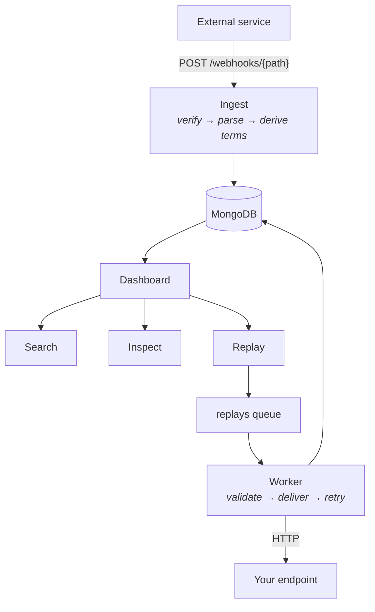
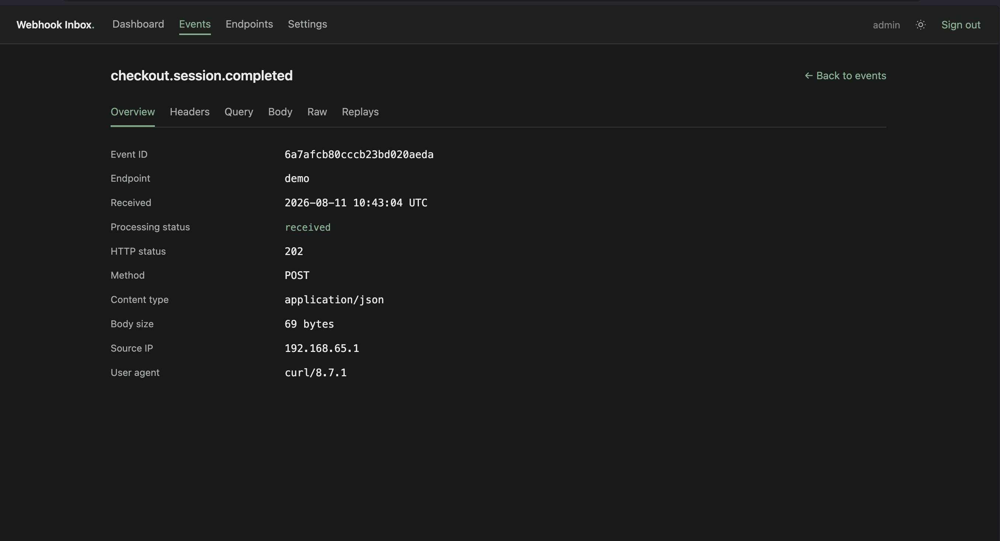
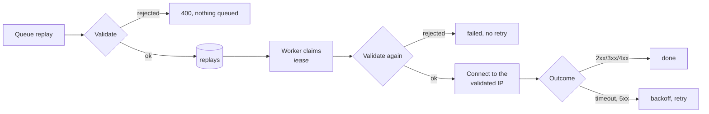

# Architecture

How Webhook Inbox is put together, and why. Where a decision had a plausible alternative, the
alternative is named and the reason for rejecting it is given.

- [Shape of the system](#shape-of-the-system)
- [Data model](#data-model)
- [Indexes](#indexes)
- [Ingestion](#ingestion)
- [Search](#search)
- [Replay](#replay)
- [Retention](#retention)
- [Export](#export)

---

## Shape of the system



One FastAPI application serves three surfaces that share nothing but the database:

| Surface | Path | Authentication |
|---|---|---|
| Ingestion | `/webhooks/{path}` | Per-endpoint signature, or none |
| Dashboard | `/`, `/events`, `/endpoints`, `/settings` | Session cookie |
| JSON API | `/api/*` | Session cookie + CSRF header |

Ingestion never touches the session collection. A webhook arriving at 2 a.m. should not pay for a
session lookup, and the two paths have genuinely different threat models: one accepts anonymous
traffic from the internet, the other guards a human's browser.

The replay worker runs inside the web process by default and as its own container in production.
Both run the same image; see [compose.prod.yaml](../compose.prod.yaml).

---

## Data model

Five collections: `events`, `endpoints`, `users`, `sessions`, `replays`.

An event is stored as one document containing everything about the request:

```json
{
  "_id": "...",
  "endpoint": { "id": "...", "name": "stripe" },
  "received_at": "2026-08-11T13:45:34.221Z",
  "event_type": "checkout.session.completed",
  "request": {
    "method": "POST",
    "headers": { "content-type": "application/json", "stripe-signature": "..." },
    "query": { "attempt": "1" },
    "body": { "id": "evt_...", "data": { "object": { } } },
    "raw_body": "{\"id\":\"evt_...\"}",
    "raw_encoding": "utf-8",
    "content_type": "application/json",
    "body_size": 1284
  },
  "processing": { "status": "received", "response_status": 202 },
  "metadata": { "source_ip": "203.0.113.7", "user_agent": "Stripe-Hookshot/1.0" },
  "search": { "tokens": ["checkout", "session", "completed"], "trigrams": [" ch", "che"] },
  "expires_at": "2026-11-09T13:45:34.221Z"
}
```

<div align="center">

</div>

**Why a document store is the right fit here.** Webhook payloads have no shared schema — a Stripe
event and a GitHub push have nothing structurally in common, and both change without warning. In a
relational model you would either add a JSON column (a document store with extra steps) or normalise
into a key-value table and lose the ability to query nested structure. Here the payload is stored as
it arrived and remains directly queryable and indexable at any depth.

**Both the parsed body and the raw bytes are kept.** `body` is queryable; `raw_body` is what actually
arrived. They are not redundant:

- Signature verification runs against the raw bytes, before any parsing. Re-serialising JSON changes
  whitespace and key order, which would break every HMAC.
- Replay resends the original bytes, so a receiver verifying a signature still sees a valid one.
- A body that is not valid UTF-8 is stored base64-encoded, with `raw_encoding` recording which.
- A body too deeply nested to walk safely is stored raw with `body: null` (see
  [Ingestion](#ingestion)).

**Restricted key names are escaped.** MongoDB forbids `.` and a leading `$` in field names, but
webhook payloads contain both. Keys are stored with lookalike codepoints — `.` becomes `．` (U+FF0E),
a leading `$` becomes `＄` (U+FF04) — and unescaped on read and on export. A payload key that
genuinely contained those lookalikes would round-trip incorrectly, which is why `raw_body` stays
authoritative.

**The endpoint name is denormalised onto each event** so the list view renders without a join.
The trade is that renaming an endpoint does not rewrite the name stored on past events; `endpoint.id`
remains the join key for anything that must be correct.

---

## Indexes

Every index earns its place. Nothing here is speculative.

### `events`

| Index | Serves |
|---|---|
| `{endpoint.id: 1, received_at: -1}` | The default list: filter by endpoint, sort by recency. The hottest query. |
| `{received_at: -1}` | The unfiltered list and the dashboard's recent events |
| `{processing.status: 1, received_at: -1}` | Status filter combined with the usual sort |
| `{event_type: 1}` | Event-type filter, and the distinct values behind the filter dropdown |
| `{search.tokens: 1}` | Multikey inverted index: exact, prefix and multi-term matching |
| `{search.trigrams: 1}` | Multikey: fuzzy candidate retrieval |
| `{expires_at: 1}` TTL | Retention. Documents without the field are never deleted |

`search.tokens` and `search.trigrams` are separate indexes because MongoDB will not compound two
array fields into one.

### Other collections

| Collection | Index | Serves |
|---|---|---|
| `endpoints` | `{path: 1}` unique | Route dispatch on every inbound webhook; paths must not collide |
| `users` | `{username: 1}` unique | Sign-in |
| `sessions` | `{token_hash: 1}` unique | Session resolution on every dashboard request |
| `sessions` | `{expires_at: 1}` TTL | Expiry, swept by MongoDB rather than by application code |
| `sessions` | `{user_id: 1}` | Revoking every session for a user on password change |
| `replays` | `{event_id: 1, created_at: -1}` | Replay history on the event page |
| `replays` | `{state: 1, next_attempt_at: 1}` | The worker's lease scan |

`ensure_indexes()` runs at startup and is idempotent.

**Measured cost.** At 100,000 events: 78.6 MB of data, 5.1 MB for the token index, 23.0 MB for the
trigram index, 29.1 MB of indexes in total — 0.37× the data size. The benchmark in
`tests/integration/test_search_perf.py` asserts `explain()` shows no collection scan.

---

## Ingestion

`POST /webhooks/{path}` accepts any of GET, POST, PUT, PATCH, DELETE, subject to what the endpoint
allows. **The order of checks is deliberate** — each step is cheaper than the one after it, and the
expensive ones must not run for traffic that will be rejected anyway:

```
header count / header size / query length   ← free, no I/O
rate limit                                  ← free, in memory
endpoint lookup                             ← first database read
enabled? method allowed?
read body, refusing oversize before buffering
signature verification                      ← against untouched bytes
parse, derive search terms, compute expiry
insert
```

Shape limits and the rate limit run **before** the database is touched, so a flood of malformed
requests cannot turn into a flood of queries. The rate-limit key is the endpoint path plus the client
address, which is available from the URL without a lookup.

Oversized payloads are refused **before buffering**: `Content-Length` is checked when present, and
the streamed body is abandoned the moment it exceeds the limit. A chunked request that lies about its
length is still caught.

**Nesting depth is measured over the raw bytes** before parsing, with a scan that tracks string and
escape state so brackets inside strings are not counted. `json.loads`, key escaping and the tokeniser
all recurse over the parsed structure; a payload nested a few thousand deep is only a few kilobytes,
so it passes the size check and would otherwise exhaust the stack. Over-deep bodies are stored with
`raw_body` intact and `body: null` — the webhook is never lost, it is simply not walked.

Signature verification **fails closed**: an unrecognised authentication type, a missing secret or a
missing header are all rejections, never a pass. Comparison uses `hmac.compare_digest`.

---

## Search

Search terms are derived **at write time** and stored on the event. Query time never parses a
payload.

### What gets indexed

Endpoint name, event type, header names and values, query names and values, and every key and string
leaf of the body. Numbers are indexed as text; booleans are not, because `true` would match nearly
every event.

**Sensitive keys are excluded at write time**, reusing the same `is_sensitive` check the log redactor
uses. A body field called `api_key` is stored and visible on the event page but never becomes a
searchable term — otherwise search would quietly reintroduce the leak redaction exists to prevent.

Both arrays are capped (512 tokens, 2048 trigrams) so a single enormous payload cannot dominate a
multikey index. Oversized payloads lose the tail of their terms.

### Tokens and trigrams

Values are lowercased and split on non-alphanumeric characters. An identifier with no whitespace also
keeps its unsplit form, so `checkout.session.completed` yields the three parts **and** the whole
string, and an exact-phrase search still hits:

```
"checkout.session.completed"
  → ["checkout", "session", "completed", "checkout.session.completed"]
```

Trigrams are generated from each token of three characters or more, space-padded so prefixes anchor:

```
"checkout" → [" ch", "che", "hec", "eck", "cko", "kou", "out", "ut "]
```

### Ranking

Four tiers, highest wins, scored in a single pass:

| Tier | Match | Score |
|---|---|---|
| 1 | A token equals the query | 100 |
| 2 | A token starts with the query | 60 |
| 3 | Every query term is present | 40 |
| 4 | Trigram overlap ≥ 0.4 | 30 × ratio |

where ratio is `|shared trigrams| / |query trigrams|`. Results below 12 are discarded.

So searching `chekout` — a typo matching nothing exactly — returns the literal `chekout` event first
and `checkout.session.completed` below it, which is exactly the behaviour the dashboard screenshot
shows.

### Why there is no `$text` index

The obvious approach is MongoDB's `$text` index. It was tested against a real MongoDB 8 rather than
assumed, and the results were:

| Probe | Result |
|---|---|
| `$text` as the first pipeline stage | works |
| `$text` inside `$facet` | **fails** — text score metadata unavailable |
| `$text` inside a `$unionWith` sub-pipeline | **works**, and `$meta: "textScore"` works there too |
| `$text` after any other stage | fails — must be first |
| A second text index on the collection | fails — only one is allowed |

So `$text` *does* compose, through `$unionWith`. It was still rejected, on cost rather than
capability:

- It permanently spends the single text index a collection is allowed.
- It needs a separate field duplicating words `search.tokens` already holds.
- Its only real gain is stemming, and webhook payloads are identifiers, enums and IDs, not prose.
  Stemming `checkout.session.completed` buys nothing.
- Its tokeniser is not ours, so ranking becomes less predictable exactly where scoring control
  matters most.

Dropping it simplified the design rather than complicating it. With no stage-ordering constraint
left, the tiered query stopped needing `$unionWith` plus `$group` to deduplicate and became a single
pass: one `$match` with an indexed `$or`, one `$switch` assigning the tier score, one threshold
`$match`.

`SearchBackend` is a protocol, so a `$text` or MongoDB Search backend can be added later without
touching the routes.

**Known limitation.** Transposing adjacent characters in a short word destroys every trigram, so
`jhon` does not find `john`. Deletions and substitutions are fine — `creted` finds `created`. Fixing
transposition means edit distance, a different and far more expensive mechanism.

### Pagination

Keyset, never `skip`, which degrades on deep pages. Unranked listing pages on `received_at`; ranked
searches use a compound cursor of `score|received_at|_id`, so the last page costs what the first
does.

---

## Replay

Replay resends a stored event to a URL the user supplies. That is an SSRF engine unless constrained,
so the constraints are the design.



**Destinations are validated twice, deliberately.** The API validates at queue time so the user gets
immediate feedback, and the worker validates again immediately before connecting. The gap between
queueing and sending is exactly where DNS can change underneath you.

Validation rejects any scheme other than `http`/`https`, URLs carrying credentials, and any hostname
resolving to a private, loopback, link-local, multicast, reserved or unspecified address — IPv4 and
IPv6, including IPv4-mapped IPv6 such as `::ffff:127.0.0.1`. **If a hostname resolves to several
addresses and any one of them is blocked, the whole name is refused**; one public answer does not
excuse a private one.

**Connections go to the validated IP**, with `Host` and TLS SNI carrying the real hostname. Resolving
once for validation and letting the HTTP client resolve again at connect time would leave the
rebinding hole wide open.

**Redirects are followed by hand.** The client is always configured with `follow_redirects=False`;
each hop is re-validated from scratch through the same rules. Letting the client follow redirects
would re-resolve DNS outside validation entirely.

**Retries are narrow.** Timeouts, connection errors and 5xx are retried with exponential backoff.
4xx never is — the destination understood the request and refused it. A rejected destination is never
retried, because validation failure cannot fix itself.

**Headers are filtered.** `Authorization`, `Cookie` and `Proxy-Authorization` are never forwarded:
they are reusable credentials. Signature headers such as `x-hub-signature-256` **are** forwarded —
they are derived from the body being sent, useless anywhere else, and replaying them is the whole
point of testing a receiver's verification locally.

The queue is the `replays` collection, leased with `findOneAndUpdate` on `next_attempt_at`. A worker
that dies mid-attempt leaves the job `running`; leases older than `lease_timeout` are reclaimed. No
Redis, no broker — the database already provides atomic claim.

---

## Retention

`expires_at` is computed per event at ingest, from the endpoint's `retention_days` if set, otherwise
the global default. A TTL index on that field does the deleting.

**When retention is disabled the field is absent entirely**, rather than null. MongoDB's TTL monitor
ignores documents that lack the field, so "keep forever" is expressed by absence rather than by a
sentinel.

Changing an endpoint's retention **recomputes the expiry of its stored events**, server-side via a
`$dateAdd` pipeline update. Without that, an override would silently apply only to future events.
Changing the *global* default does not rewrite existing events.

**TTL deletion is approximate.** MongoDB's background task runs about once a minute, so events are
removed shortly *after* their expiry, not exactly on it. Measured on a live stack: a backdated event
disappeared 22 seconds after expiring. This is stated in the dashboard's settings page too, because
"deleted after 30 days" implying a precise moment is the kind of assumption that causes trouble.

---

## Export

JSON, JSONL and CSV, all streamed. The response carries `Transfer-Encoding: chunked` and no
`Content-Length`, which is the observable proof it is not buffered — memory stays flat regardless of
result size.

Exports reuse the event list's filter parser, so an export can never disagree with the table it was
launched from; search queries, including fuzzy ones, carry through.

The internal `search` sub-document is stripped, body keys are unescaped, and CSV cells beginning with
`=`, `+`, `-` or `@` are prefixed with a quote so spreadsheet software cannot evaluate an
attacker-supplied `event_type` as a formula.

Export is unbounded by design. Memory is flat, but a filterless export of a very large collection
holds a cursor open for a long time.
